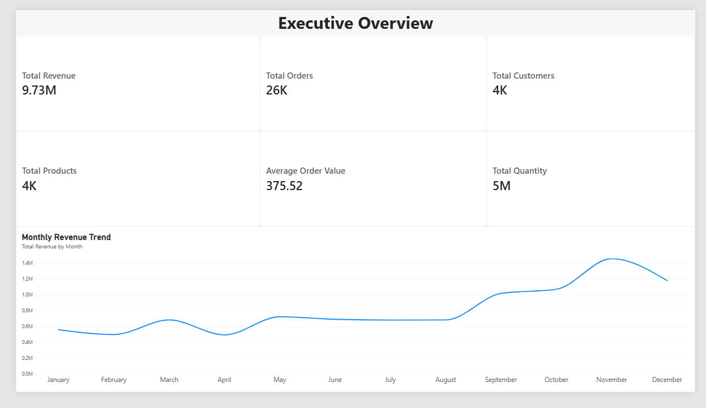
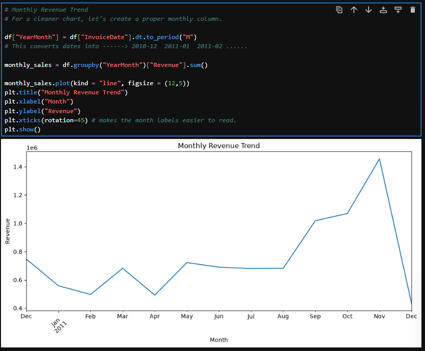
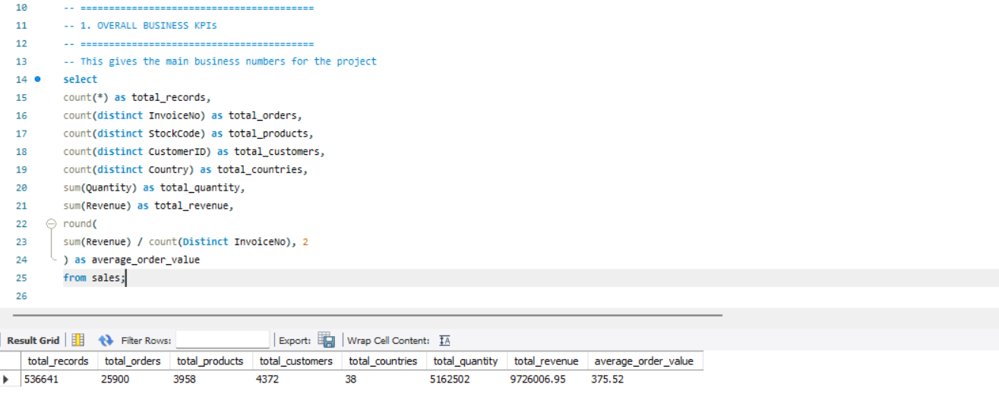
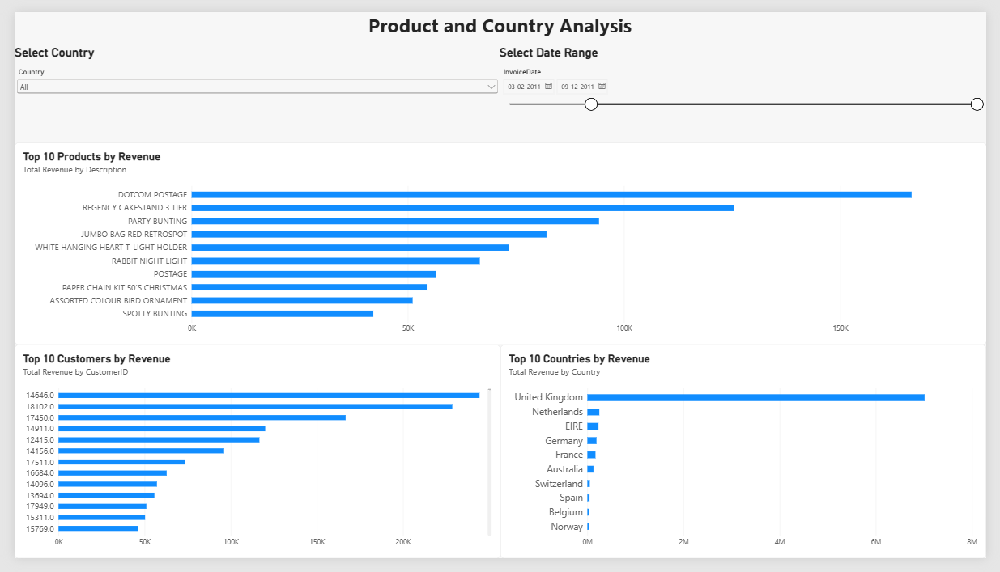
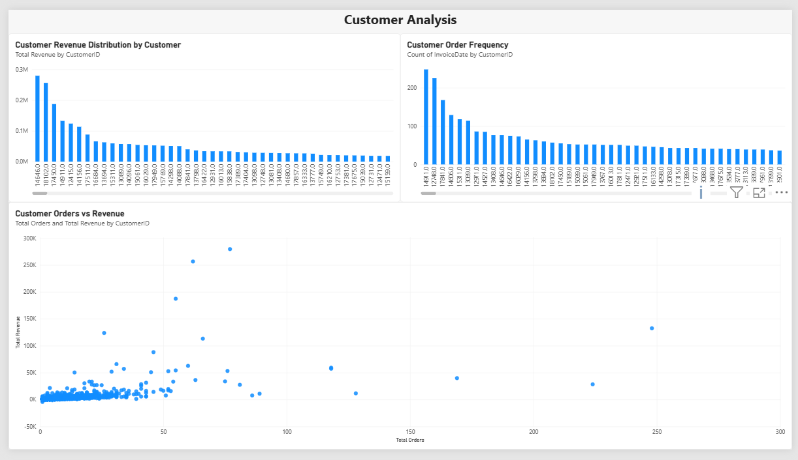
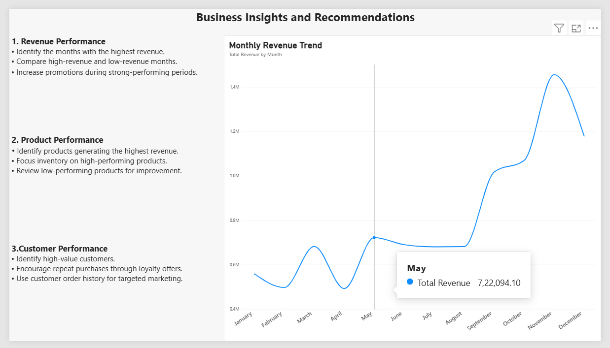

# 🛒 E-Commerce Sales & Customer Analytics

End-to-end data analytics project that turns raw e-commerce transaction data into business insights using **Python, MySQL, SQL and Power BI**.



**Key results**
- Cleaned and analyzed **536,641 transaction records** across **4,339 identified customers**, **4,059 products** and **38 countries**
- Total revenue of **£10.62M** from **22,064 orders**, with an average order value of **£481.33**
- The **United Kingdom** generated **84.6%** of revenue, and **November 2011** was the best month (**£1.50M**)
- Cancellation rate: **1.72%** of transactions; **65.6%** of identified customers placed more than one order

---

## 📌 Project Overview

This project analyzes e-commerce sales data to understand sales performance, customer behavior, product performance and country-wise revenue.

**Workflow**

```
Raw Data → Python (cleaning + EDA) → MySQL → SQL Analysis → Power BI Dashboard → Business Insights
```

1. Data cleaning using Python and Pandas
2. Exploratory Data Analysis using Pandas, Matplotlib and Seaborn
3. Data storage in MySQL
4. Business analysis using SQL
5. Interactive 4-page dashboard in Power BI with DAX KPIs
6. Business insights and recommendations

---

## 🎯 Business Objectives

- Measure total revenue and sales performance
- Identify the highest-performing months
- Find the top-selling products
- Identify high-value customers
- Analyze customer order frequency
- Compare country-wise revenue
- Understand cancelled and completed transactions
- Build KPIs and an interactive dashboard
- Provide business recommendations

---

## 📊 Dataset

- **Source:** Online Retail dataset (UCI Machine Learning Repository / Kaggle), transactions from a UK-based online retailer
- **Period:** 1 December 2010 to 9 December 2011 (December 2011 is a partial month)
- **Size after cleaning:** 536,641 rows × 9 columns

| Column | Description |
|--------|-------------|
| InvoiceNo | Unique invoice or transaction number |
| StockCode | Product code |
| Description | Product description |
| Quantity | Number of products purchased |
| InvoiceDate | Date and time of the transaction |
| UnitPrice | Price of one product |
| CustomerID | Unique customer identifier |
| Country | Customer's country |
| Revenue | Quantity × UnitPrice |

---

## 🧹 Data Cleaning (Python)

- Loaded the raw dataset with Pandas and inspected structure, data types and missing values
- Removed records with invalid quantities and invalid prices
- Identified cancelled transactions
- Found **135,037 records (25.2%)** with no CustomerID; they are kept in revenue analysis and excluded from customer-level analysis
- Converted `InvoiceDate` to a proper date-time format
- Created a `Revenue` column (`Quantity × UnitPrice`)
- Exported the cleaned dataset for MySQL

---

## 🔍 Exploratory Data Analysis

EDA covered missing and duplicate values, product, customer and country analysis, monthly sales trends, and cancelled transactions.



---

## 🗄️ SQL Analysis (MySQL)

The cleaned data was loaded into MySQL (`ecommerce_analysis` database, `sales` table).

**SQL concepts used:** SELECT, WHERE, ORDER BY, GROUP BY, HAVING, aggregate functions, CASE WHEN, JOINs, subqueries, CTEs, window functions, date functions, ranking functions.

**Business questions answered**

- What is the total revenue, number of orders and number of customers?
- What is the average order value?
- Which months generated the highest revenue, and what is the monthly growth?
- Who are the top customers and top products by revenue?
- Which countries generate the most revenue?
- Which products perform best in each country?
- What is the cancellation rate?



---

## 📐 Key KPIs (DAX)

```
Total Revenue = SUM(sales[Revenue])
Total Orders = DISTINCTCOUNT(sales[InvoiceNo])
Total Customers = DISTINCTCOUNT(sales[CustomerID])
Total Products = DISTINCTCOUNT(sales[StockCode])
Total Quantity = SUM(sales[Quantity])
Average Order Value = DIVIDE([Total Revenue], [Total Orders])
```

| KPI | Value |
|-----|-------|
| Total Revenue | £10,619,987 |
| Total Orders | 22,064 |
| Total Customers | 4,339 |
| Total Products | 4,059 |
| Total Quantity Sold | 5,438,062 |
| Average Order Value | £481.33 |

*KPIs are calculated on completed sales (cancelled transactions excluded).*

---

## 📈 Power BI Dashboard (4 pages)

**Page 1: Executive Overview** — KPI cards and monthly revenue trend


**Page 2: Product & Country Analysis** — top products, countries and customers, with country and date filters



**Page 3: Customer Analysis** — revenue distribution, order frequency and orders vs revenue



**Page 4: Business Insights & Recommendations**



---

## 💡 Key Business Insights

**Revenue**
- Total revenue was **£10.62M** from **22,064 orders**, with an average order value of **£481.33**.
- **November 2011** was the best month (**£1.50M**) and **February 2011** was the weakest (**£0.52M**), so revenue peaks strongly towards the end of the year.

**Products**
- Top products by revenue: Regency Cakestand 3 Tier (£174K), Paper Craft Little Birdie (£168K), White Hanging Heart T-Light Holder (£106K) and Party Bunting (£99K).
- "DOTCOM POSTAGE" (£206K) is a postage charge rather than a product, so it is excluded from the product ranking.
- The top 10 products contribute only **10.9%** of revenue, so sales are spread across a wide catalogue of 4,059 products.

**Customers**
- **65.6%** of identified customers placed more than one order.
- The top 10 customers generate **14.5%** of total revenue, so revenue is not overly dependent on a few buyers.
- **25.2%** of transactions have no CustomerID, which limits customer-level analysis.

**Countries**
- The **United Kingdom** generates **84.6%** of revenue, followed by the Netherlands (2.7%), EIRE (2.7%), Germany (2.2%) and France (2.0%).

**Cancellations**
- **1.72%** of transactions (9,251) were cancelled.

---

## ✅ Business Recommendations

1. **Prepare for the year-end peak.** Revenue is highest in November, so plan inventory, staffing and promotions ahead of the autumn months.
2. **Lift the slow months.** February is the weakest month, so run targeted promotions or bundles in January and February.
3. **Grow beyond the UK.** The UK generates 84.6% of revenue, while the Netherlands, EIRE, Germany and France each contribute only 2-3%. These are the natural markets to test for growth, and reduce dependence on one country.
4. **Reward repeat buyers.** With 65.6% of customers ordering more than once, loyalty offers and personalized campaigns can increase order frequency.
5. **Improve customer data capture.** A quarter of transactions have no CustomerID, so collecting it at checkout would allow better customer analysis.
6. **Keep monitoring cancellations.** The 1.72% rate is low, but tracking the reasons can prevent it from rising.

---

## 🛠️ Tools & Technologies

| Area | Tools |
|------|-------|
| Programming & Analysis | Python, Pandas, NumPy, Matplotlib, Seaborn, Jupyter Notebook |
| Database | MySQL, MySQL Workbench, SQL |
| Visualization | Power BI, DAX |
| Environment & Version Control | Anaconda, VS Code, Git, GitHub |

---

## 📁 Project Structure

```
E-Commerce-Sales-Customer-Analytics
│
├── data
│   └── cleaned_sales_mysql.csv
│
├── python
│   └── ecommerce_analysis.ipynb
│
├── sql
│   └── ecommerce_final_analysis.sql
│
├── powerbi
│   └── ecommerce_sales_customer_analytics.pbix
│
├── screenshots
│   ├── python
│   ├── sql
│   └── powerbi
│
├── .gitignore
└── README.md
```

---

## 🧩 Challenges Faced and Solutions

| Challenge | Solution |
|-----------|----------|
| MySQL connector gave a client-library error in Power BI | Connected Power BI to MySQL through an ODBC connection |
| Duplicate column errors during import | Checked and corrected the table structure and column names before re-importing |
| Missing CustomerID values | Identified them during cleaning and handled them in customer-level analysis |
| MySQL connection loss on a large dataset | Restarted the MySQL service, checked the connection and re-imported the data |
| Slow SQL queries on 500,000+ rows | Split the analysis into smaller queries and used filters |

---

## ▶️ How to Run

1. Clone the repository
   ```
   git clone https://github.com/SV-181002/ecommerce-sales-customer-analytics.git
   ```
2. Install the libraries
   ```
   pip install pandas numpy matplotlib seaborn jupyter
   ```
3. Run the notebook in the `python` folder to clean the data
4. Load `data/cleaned_sales_mysql.csv` into a MySQL table named `sales`, then run `sql/ecommerce_final_analysis.sql`
5. Open the `.pbix` file in Power BI Desktop

---

## 🏁 Conclusion

This project shows a complete analytics workflow: cleaning 536,641 transactions with Python, analyzing them with SQL in MySQL, and presenting KPIs and insights in an interactive Power BI dashboard to support business decisions.

---

## 👨‍💻 Author

**Durgampudi S V Krishna Reddy**
MCA — Data Analyst

📧 reddydsvkrishna@gmail.com
🔗 [LinkedIn](https://linkedin.com/in/sv181002) | [GitHub](https://github.com/SV-181002)
